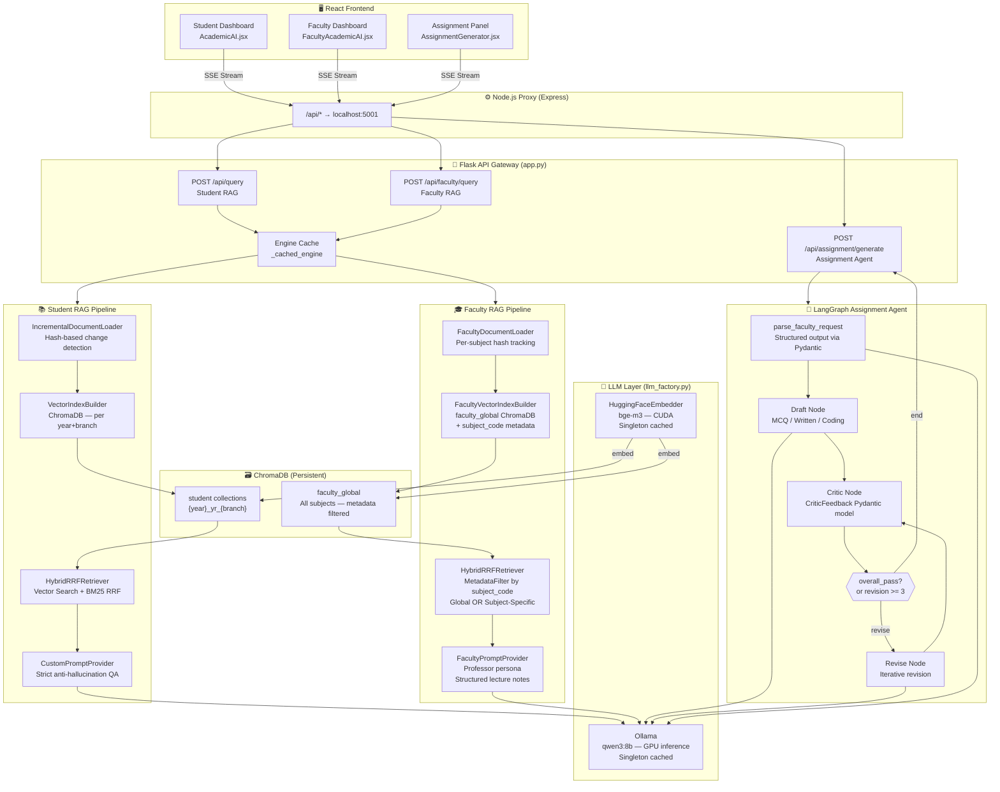

# AMS AI Backend — System Architecture

## Overview

The Academic Management System (AMS) backend is a **dual-pipeline AI system** built on a plugin-based modular architecture. It powers three distinct AI capabilities: a Student RAG Q&A engine, a Faculty Lecture Notes Compiler, and a self-correcting Assignment Generation Agent.

---

## System Architecture Diagram



---

## Component Responsibilities

| Component | File(s) | Role |
|---|---|---|
| **Flask API Gateway** | `app.py` | Routing, SSE streaming, engine caching |
| **Incr. Document Loader** | `ingestion/data_loader.py` | Hash-based change detection for student corpus |
| **Faculty Loader** | `ingestion/faculty_loader.py` | Per-subject hash tracking for faculty textbooks |
| **Vector Index Builder** | `ingestion/build_vector_index.py` | ChromaDB upsert; per year+branch collection |
| **Faculty Index Builder** | `ingestion/faculty_vector_index.py` | Global ChromaDB collection with `subject_code` metadata |
| **Hybrid RRF Retriever** | `retrieval/hybrid_retriever.py` | Dense Vector + BM25 fused via Reciprocal Rank Fusion |
| **Student Prompt** | `prompts/base.py` | Strict grounded QA — anti-hallucination |
| **Faculty Prompt** | `prompts/faculty_prompts.py` | Professor persona — structured lecture notes |
| **Assignment Prompts** | `prompts/assignment_prompts.py` | Draft / Critic / Revise prompts for 3 question types |
| **Assignment Agent** | `agents/assignment_agent.py` | LangGraph Reflexion loop — Draft→Critic→Revise |
| **LLM Factory** | `llm_factory.py` | Singleton LLM provider (Ollama / Local quantized) |
| **Config** | `config.yaml` / `faculty_config.yaml` | All settings externalized |

---

## Data Flow — Faculty RAG (Subject Filtered)

```
Professor selects "CS101" in UI
        ↓
React sends { query, subject_codes: ["CS101"] }
        ↓
Flask parses → _get_engine(subject_code=["CS101"])
        ↓
FacultyVectorIndex checks hash → builds/syncs faculty_global ChromaDB
        ↓
HybridRRFRetriever:
  ├── VectorIndexRetriever (MetadataFilter: subject_code=CS101)
  └── BM25Retriever (programmatic filter on loaded nodes)
        ↓
RRF Re-ranking → top fusion_top_k nodes
        ↓
FacultyPromptProvider injects professor persona
        ↓
Ollama qwen3:8b generates structured lecture notes
        ↓
SSE stream → token by token → React UI
```

---

## Key Design Decisions

1. **Global Index + Metadata Filtering** over per-subject indexes — enables both global cross-subject search and isolated subject-specific search with a single architecture.
2. **BM25 Node Caching** — nodes serialized to `.pkl` after first ChromaDB reconstruction; invalidated on document change.
3. **Singleton Pattern** for LLM and Embedder — prevents redundant model weight loading into VRAM.
4. **Plugin Architecture via ABCs** — `interfaces/` defines contracts for every component; swap any piece without touching the rest.
5. **Reflexion Agent** — self-corrects assignments up to 3 iterations using structured `CriticFeedback` before finalizing.
